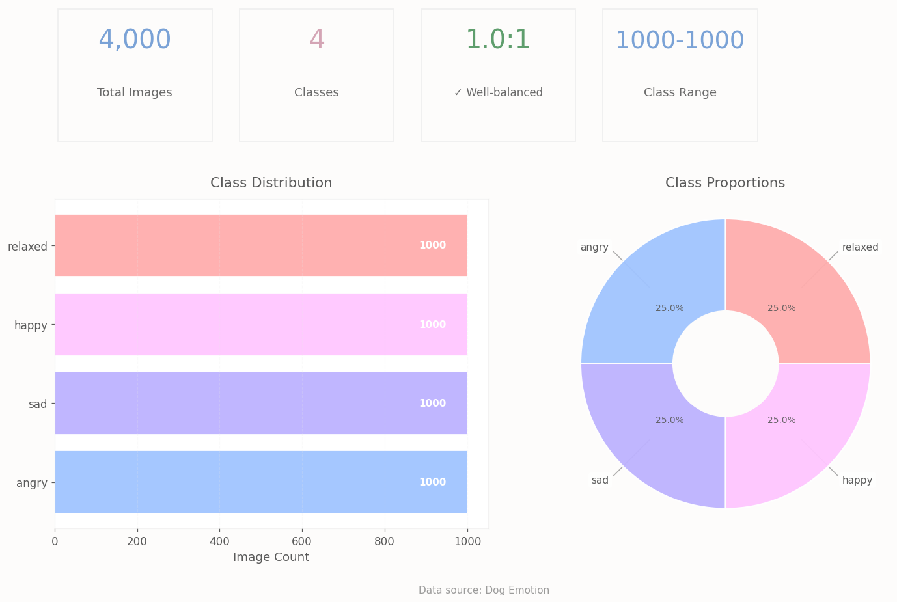

# 🐶 Классификатор эмоций собак 🐾

## 🔷 Введение

Этот проект посвящён классификации эмоций собак с помощью искусственного интеллекта. Наши четвероногие друзья обладают богатым эмоциональным миром — от радостных "зумов" при возвращении хозяина до грустных "щенячьих глаз" при расставании. Цель проекта — количественно определить эти эмоции с помощью машинного обучения.

> "Величайшее удовольствие собаки — это то, что вы можете выглядеть глупо рядом с ней, и она не станет вас ругать, а сама тоже будет выглядеть глупо."  
> – Самюэл Батлер

## 🎯 Задачи и возможные применения

- **Ветеринарная диагностика:** раннее выявление хронического стресса у собак  
- **Умные камеры для домашних животных:** оповещения владельцев в реальном времени о настроении питомца  
- **Благополучие животных:** повышение шансов на усыновление собак из приютов  
- **Исследования поведения:** изучение эмоциональных состояний собак (грусть, радость и др.)

## 📊 Датасет

Используется датасет Dog Emotion с Kaggle, содержащий 4000 изображений, разделённых на 4 категории эмоций:

| Эмоция       | Описание                        | Пример использования           |
|--------------|--------------------------------|-------------------------------|
| 😊 Счастье   | Виляющий хвост, расслабленное лицо | "Ура! Хозяин дома!"            |
| 😠 Злость    | Оскал зубов, напряжённая поза  | "Это МОЯ кость!"               |
| 😞 Грусть    | Опущенные уши, "щенячьи глаза" | "Почему ты оставляешь меня одного?" |
| 😌 Расслабленность | Спокойное выражение, возможно, сон | "Просто отдыхаю с моим хозяином" |

Данные для обучения доступны по ссылке:  
[Dog Emotion Dataset на Kaggle](https://www.kaggle.com/datasets/danielshanbalico/dog-emotion)

### Структура датасета

Dataset Structure:

Dog Emotion/
├── angry/
│   ├── dog1.jpg
│   └── ...
├── happy/
├── sad/
└── relaxed/

## 🚀 О проекте

В рамках работы я улучшал модель классификации эмоций собак и экспериментировал с обработкой изображений в реальном времени.

## 🛠 Технологии

- Python  
- TensorFlow / PyTorch
- OpenCV (для обработки изображений в реальном времени)  
- Kaggle (для работы с датасетом)

## 🔹 Визуализация набора данных
-  Идеальный баланс: 1000 изображений на каждую эмоцию (Радость , гнев , грусть , расслабление )
-  Визуализировано: Элегантные пастельные графики показывают одинаковое распределение на 25%
-  Нет предвзятости: Все классы одинаковы - идеально для тренировок
-  Быстрая аналитика: чистые столбчатые / круговые диаграммы со встроенными подсчетами

